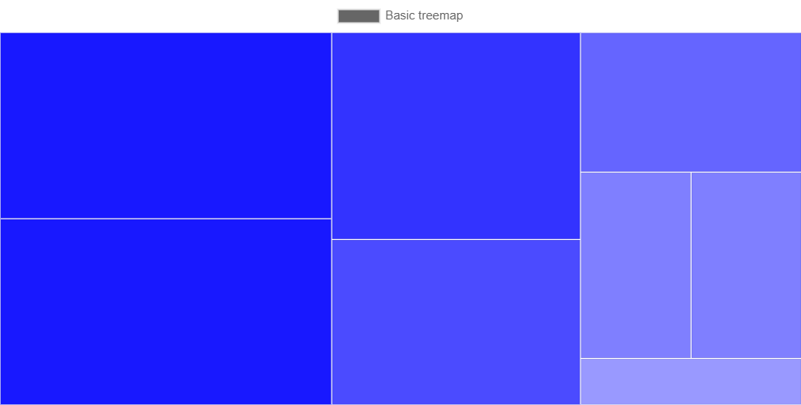

# chartjs-chart-treemap

[Chart.js](https://www.chartjs.org/) **v3.8+, v4+** module for creating treemap charts. Implementation for Chart.js v2 is in [2.x branch](https://github.com/kurkle/chartjs-chart-treemap/tree/2.x)

[](https://www.npmjs.com/package/chartjs-chart-treemap)
[](https://github.com/kurkle/chartjs-chart-treemap/releases/latest)

[](https://sonarcloud.io/summary/new_code?id=kurkle_chartjs-chart-treemap)
[](https://sonarcloud.io/summary/new_code?id=kurkle_chartjs-chart-treemap)
[](https://chartjs-chart-treemap.pages.dev)


chartjs-chart-treemap adds a `treemap` chart type to Chart.js that displays hierarchical (tree-structured) data as a set of nested rectangles, where each rectangle's area is proportional to the value it represents. It's for visualizing part-to-whole or hierarchical data — disk usage, sales by category, org structures — in less space than a bar or pie chart would need.

## Example



## Installation

```bash
npm install chartjs-chart-treemap
```

Or via CDN:

```html
<script src="https://cdn.jsdelivr.net/npm/chart.js"></script>
<script src="https://cdn.jsdelivr.net/npm/chartjs-chart-treemap"></script>
```

## Quickstart

```js
import { Chart, registerables } from 'chart.js';
import { TreemapController, TreemapElement } from 'chartjs-chart-treemap';

Chart.register(...registerables, TreemapController, TreemapElement);

new Chart(document.getElementById('chart'), {
  type: 'treemap',
  data: {
    datasets: [
      {
        tree: [6, 6, 4, 3, 2, 2, 1],
        backgroundColor: 'rgba(54, 162, 235, 0.6)',
      },
    ],
  },
});
```

See more integration options (script tag, other module loaders) in the [documentation](https://chartjs-chart-treemap.pages.dev/integration).

## Documentation

Full documentation, including the dataset and options reference, is at [https://chartjs-chart-treemap.pages.dev/](https://chartjs-chart-treemap.pages.dev/).

## Development

You first need to install node dependencies  (requires [Node.js](https://nodejs.org/)):

```bash
> npm install
```

The following commands will then be available from the repository root:

```bash
> npm run build         // build dist files
> npm run dev           // build and watch for changes
> npm test              // run all tests
> npm run lint          // perform code linting
> npm package           // create an archive with dist files and samples
```

## License

chartjs-chart-treemap is available under the [MIT license](https://opensource.org/licenses/MIT).
